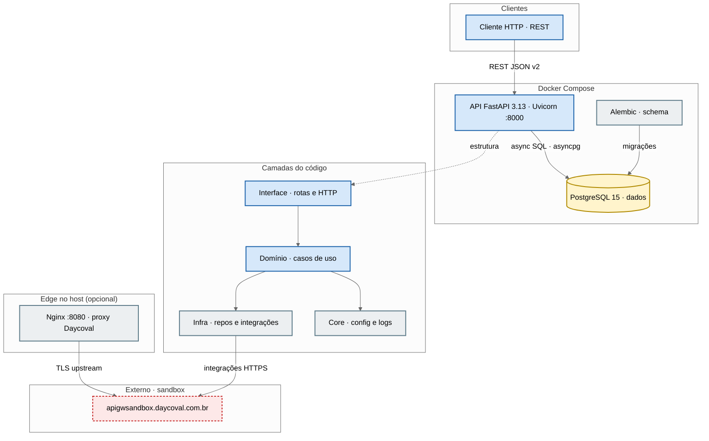

# Hub Banking Platform

Plataforma de automação financeira: API **REST** em **FastAPI** (Python 3.13), persistência em **PostgreSQL**, migrações com **Alembic**, empacotamento com **Poetry** e **Docker**.

## Stack

| Camada | Tecnologia |
|--------|------------|
| API | FastAPI · Uvicorn · OpenAPI (`/docs` em modo debug) |
| Dados | PostgreSQL 15 · SQLAlchemy 2 async · asyncpg |
| Migrações | Alembic (`migrations/`) |
| Segurança | JWT · Argon2 (hash de senhas) |
| Ambiente | Poetry · Docker Compose |

## Pré-requisitos

- **Python** ≥ 3.13  
- **Poetry**  
- **Docker** e **Docker Compose** (para subir Postgres + API via Compose)

## Configuração rápida

1. Copie as variáveis de ambiente e preencha os valores necessários:

   ```bash
   cp env.example.env .env
   ```

2. Instale dependências:

   ```bash
   poetry install
   ```

3. Ajuste `SQLALCHEMY_DATABASE_URI` e demais chaves no `.env` (veja `env.example.env`).

## Executar localmente (sem Docker só da API)

Com Postgres acessível conforme o `.env`:

```bash
make run
```

Ou diretamente (usa `API_PORT` do `.env`):

```bash
poetry run uvicorn src.main:app --reload --workers 3 --port <PORTA>
```

## Docker Compose (Postgres + API)

Na raiz do repositório, com `.env` válido:

```bash
make build   # ou: make up
make logs    # acompanhar logs
make down    # parar e remover containers (volumes com -v)
```

O serviço da API usa o `Dockerfile` em `docker/Dockerfile` e a rede interna `hub-banking-platform-net`. O compose documenta que o **Nginx Daycoval** fica no **host** da VPS; confira `deploy/` e comentários em `docker/docker-compose.yml`.

## Comandos úteis (`Makefile`)

| Comando | Descrição |
|---------|-----------|
| `make run` | Sobe Uvicorn em desenvolvimento |
| `make build` / `make up` / `make down` | Compose conforme `docker/docker-compose.yml` |
| `make logs` | Logs em tempo real dos containers |
| `make formatter` | Formata com Black |
| `make lint` | Ruff + verificação Black |
| `make init-db` | `alembic upgrade head` |

## Estrutura do código

- `src/interface/` — rotas HTTP, controllers, schemas, middlewares  
- `src/domain/` — casos de uso, serviços, DTOs, contratos de repositório  
- `src/infrastructure/` — repositórios Postgres, modelos ORM, JWT, integrações (`external_apis/`)  
- `src/core/` — configurações, logging, exceções transversais  

Prefixo da API: `/api` (versão **v2** em `src/interface/api/v2/`).

## Arquitetura (visão geral)

O diagrama abaixo resume clientes, containers, camadas internas e o **gateway Daycoval (sandbox)**. O exemplo de **Nginx** em `deploy/nginx-daycoval-sandbox.conf` faz *proxy* **HTTPS** para `apigwsandbox.daycoval.com.br` (testes de integração no host); o acesso à **API Hub** no Compose é tipicamente direto na porta configurada (`API_PORT`), não passando por esse Nginx.



## Licença e autoria

Ver `pyproject.toml` para metadados do projeto.
